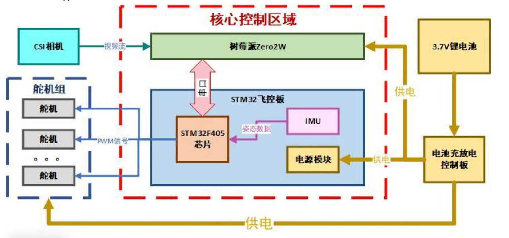

# 飞镖上位机周报

09-21-2025

基于当前战队采用拉簧式发射结构+无控飞镖，上位机与视觉暂未合体情况下，参考下面的开源工程以及报告总结(如下)

具备场上参数修正功能, 使用基于树莓派 5/香橙派 5Plus/jeston
nano 等等的可视化 gui 进行调节 PID 等参数(测试情况下)，模拟比赛调节参数过程(梯度飞镖)
<使用多次校准, 从而确定随机固定靶的位置>

## 飞镖报告以及开源

### _[西北工业大学报告(WMJ)]_

<https://bbs.robomaster.com/article/809863?source=4>
部分机械部分以及流体仿真部分可直接参考原文;
硬件部分:

软件设计部分:
WMJ 战队采用了树莓派 Zero2W 平台, 在 RaspberryOS 上使用第三方中间件以及模块,
进行识别以及处理(OpenCV), 通过 CSI 相机数据流来完成对引导灯的识别,
通信使用串口通信(基于 wringpi 库, 使用 CRC16 进行校验)

STM32 下位机使用 HAL 库, 裸机进行解包获取信息, 获取姿态,
同时会将自身的状态反馈到树莓派用于记录, 板载 BMI088 以及 IST8310,
采用 Mahony 算法四元数解算融合成九轴 IMU

#### _镖架_

上位机基于 Intel NUC10 平台(系统版本 Ubuntu 20.04).

OpenCV, GalaxyAPI(大恒工业相机函数接口以及可执行文件),
CAN 通信构成上位机软件部分

下位机使用 A 型主控, 大致框架不多叙述

### _[【RM2025-飞镖系统全站仪上位机开源】四川大学 火锅战队]_

<https://bbs.robomaster.com/article/803749?source=4>
<https://github.com/KangweiYang/dartRack_upper>

使用全站仪

该软件以 Qt(Cpp)为基础,
集成串口界面(在按照步骤点击之后会出现一个标定数据的串口)
，通过串口调节界面调节参数

### _[[RM2025]飞镖开源 西安交通大学 笃行战队]_

<https://bbs.robomaster.com/article/803714?source=4>

基于皮筋发射系统，并未开源上位机实现方案

### _[【RM2021 赛季总结】西南大学 GKD 战队区域赛技术报告开源]_

<https://bbs.robomaster.com/article/8355>

<https://gitee.com/gong-yuzhi/rmfashejia> - 发射架，结构文件以及文档

<https://gitee.com/rogue_shadowdancer/gkdfeibiao> -
飞镖，结构文件以及文档

### _[[RM-2025 制导飞镖开源]西南交通大学 Helios 战队]_

<https://bbs.robomaster.com/article/715957?source=4>
<https://github.com/kid-king-x/DartGuide2025-Helios>
RV1126 作为上位机，未提及上位机 gui 方案

### _[[南方科技大学]RM2025+飞镖系统组规划开源]_

未来飞镖组的一些指引，包括结构以及部分问题(大连理工飞镖 er 在视频当中讲到过的发射抬头问题等等)

### _[西南大学-GKD-技术报告]_

皮筋发射结构
使用 nRF24L01 模块作为远程调参接收的载体, 上位机采用 PyQT5 设计,
理论最远 10 米进行调参
使用第三方串口软件类似于 VOFA 以及 SerialPlot 进行可视化监控,
同时还可以将波形导出成为.csv 文件, 以便通过 Excel/Matlab 进行查看

### _[[RM2023]飞镖开大连理工源 华南理工大学 华南虎]_

使用 ESP32 与 STM32 系列控制板进行通信,
基于 ESP32 进行上位机开发完成了 HMI(人机界面)<应该是使用 LVGL 实现的>进行离线调参

### _[大连理工大学凌 Bug2024 飞镖开源]_

上位机软件基于 node.js 和 electron, 使用 Javascript, HTML 和 CSS 进行编写,
实现了机器人调试, 通信协议管理, 代码工程管理等等功能
上位机软件还可以将通讯数据进行可视化, 绘制成曲线或保存在本地

大连理工大学有控飞镖的视觉部分交由 STM32H7 系列主控实现

需要机械可以提供精准的参数, 对于拉簧的选型,
对于飞镖细节问题的调整(飞镖内部重量的分配, 缓冲位置的精确控制,
滑台的震动控制, 无控飞镖的精确度与一致性,
当处于不同场地不同方位时的飞镖校准)
当前方案仍旧建议为无控飞镖, 基于技术问题,
使用无控飞镖可以为后面有控飞镖做技术基础方面的参照

### _[南航 2022 飞镖开源]_

未使用上位机(无控飞镖)

## 飞镖上位机方案实现

对于飞镖上位机，现在的要求非常明确，最紧迫的一点就是打通视觉与下位机的通讯，上位机选取 jeston 系列作为当前的主控是性能最强劲的方案，保证飞镖的瞄准，视觉的具体包数据未给出，对于视觉所给出的数据需要进行解算发送给下位机，下位机的电控数据，参数等需要在进行准度测试时上传上位机，保证给予反馈曲线，方便调试人员对数据调试的总结

现在的方向目前尝试了两个

•1.使用基于 c/cpp 的 lvgl 库进行上位机开发，代码繁琐，可以使用收费的 SquareLineStudio 进行开发(可以白嫖 30 天的开发额度，但是后续收费)

•2 使用基于 cpp/python 的 Qt 库进行开发，也有对应的 Qt Designer(免费额度)

---

•基于 lvgl 开发 Linux 上位机，对于 CPU 的资源占用比较低，固定为单核跑执行文件

•基于 Qt 开发可以使用更加便捷的 PyQt5/6 等等进行开发，但是为多核调度

不过二者的资源占用差不多，为了后期的维护以及大部分开源工程的选择都为 Qt 的情况下，我先尝试了使用 Qt 进行开发的配置以及编写，目前的 ui 界面还没完全完善。多线程部分需要为未来接手小灯留下接口，对于各种数据流的输入仍需进行确定。上位机部分重要的是回调函数以及信号与槽的处理

下位机通信部分通信协议选择较多，CAN 通信、RS485 通信、Serial 通信、I2C 通信等都可以有所选择。目前还未尝试与下位机通信，可以先测试一下各种通信。

视觉方面仍然待定，需要继续与视觉进行沟通。

## 综上

上位机的 gui 以及通信部分都亟待处理与沟通，gui 不仅仅是一个调参的加加减减，还要反馈曲线，通信部分只需调用对应库进行编写逻辑嵌入上位机即可
